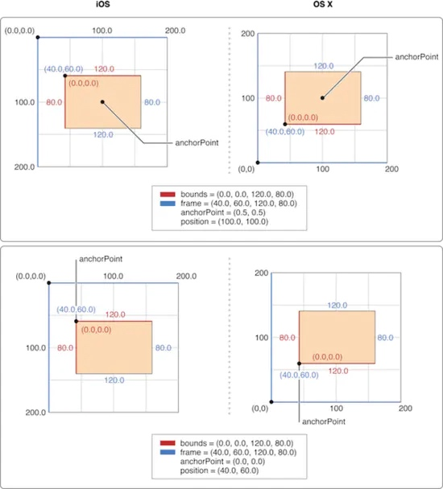

# UIView & CALayer 关系

`UIView`和`CALayer`概念上很相似，同样也是一些被层级关系树管理的矩形块，同样也可以包含一些内容，管理子图层的位置。两者不同的是：`UIView`可以处理触摸事件；`CALayer`不处理用户的交互，不参与响应事件传递。

每一个`UIView`都有一个`CALayer`实例的图层属性，我们也可以通过`UIView`的`layer`属性访问这个图层。视图的职责就是创建并管理这个图层，以确保当子视图在层级关系中添加或者被移除的时候，他们关联的图层也同样对应在层级关系树中执行相同的操作。

对于`UIView`视图来说真正的负责内容展示的其实是它内部的`CALayer`，`UIView`只是将自身的展示任务交给了内部的`CALayer`完成，而它还肩负着一些其它的任务，比如说用户的交互响应，提供一些Core Animation底层方法的高级接口等。

>思考：为什么提供提供基于UIView和CALayer两个平行的层级关系呢？
答：原因在于要做职责分离，避免重复代码。在iOS和Mac OS两个平台上，事件和用户交互有很多地方的不同，基于多点触摸的用户界面和基于鼠标键盘有着本质的区别。iOS系统中我们使用的是`UIKit`和`UIView`，而在MacOS系统使用的是`AppKit`和`NSView`，所以在这种情况下将展示部分使用`CALayer`分离出来会给苹果的多平台系统开发带来便捷。

## 定义

#### UIView定义
```java
@interface UIView : UIResponder <NSCoding, UIAppearance, UIAppearanceContainer, UIDynamicItem, UITraitEnvironment, UICoordinateSpace, UIFocusItem, UIFocusItemContainer, CALayerDelegate>

@property(class, nonatomic, readonly) Class layerClass; // default is [CALayer class]. Used when creating the underlying layer for the view.
@property(nonatomic,readonly,strong) CALayer  *layer; // returns view's layer. Will always return a non-nil value. view is layer's delegate

@end
```

#### CALayer定义
```java
@interface CALayer : NSObject <NSSecureCoding, CAMediaTiming>
```

#### UIResponder定义
```java
@interface UIResponder : NSObject <UIResponderStandardEditActions>
```

由类定义可以看出：`CALayer`是继承于`NSObject`；`UIView`是继承于`UIResponder`，`UIResponder`继承于`NSObject`。结构如下：


在UIView的定义中可以看到layer的描述，每个UIView都拥有一个非空的layer，默认是`CALayer`类型； `View`是`Layer`的代理，代理协议是`CALayerDelegate`，`UIView`内部实现`CALayerDelegate`方法。


#### CALayerDelegate定义
```c
@protocol CALayerDelegate <NSObject>
@optional

/* If defined, called by the default implementation of the -display
 * method, in which case it should implement the entire display
 * process (typically by setting the `contents' property). */

- (void)displayLayer:(CALayer *)layer;

/* If defined, called by the default implementation of -drawInContext: */

- (void)drawLayer:(CALayer *)layer inContext:(CGContextRef)ctx;

/* If defined, called by the default implementation of the -display method.
 * Allows the delegate to configure any layer state affecting contents prior
 * to -drawLayer:InContext: such as `contentsFormat' and `opaque'. It will not
 * be called if the delegate implements -displayLayer. */

- (void)layerWillDraw:(CALayer *)layer
  API_AVAILABLE(macos(10.12), ios(10.0), watchos(3.0), tvos(10.0));

/* Called by the default -layoutSublayers implementation before the layout
 * manager is checked. Note that if the delegate method is invoked, the
 * layout manager will be ignored. */

- (void)layoutSublayersOfLayer:(CALayer *)layer;

/* If defined, called by the default implementation of the
 * -actionForKey: method. Should return an object implementing the
 * CAAction protocol. May return 'nil' if the delegate doesn't specify
 * a behavior for the current event. Returning the null object (i.e.
 * '[NSNull null]') explicitly forces no further search. (I.e. the
 * +defaultActionForKey: method will not be called.) */

- (nullable id<CAAction>)actionForLayer:(CALayer *)layer forKey:(NSString *)event;

@end
```


## 布局关系
一个`CALayer`的布局是由它的`anchorPoint`, `position`, `bounds`和`transform`共同决定的，而`UIView`的`frame`只是简单的返回其`layer`的`frame`，同样`UIView`的`center`和`bounds`也是返回 其`Layer`的一些属性。

CALayer有两种坐标系类型："基于点的坐标系"和"基于单位的坐标系"

1、**基于点的坐标系**: 指定直接映射到屏幕坐标的值或必须相对于另一个图层指定的值时使用基于点的坐标，例如图层的position属性。基于点的坐标系相关的属性：bounds、position、frame。

2、**基于单位的坐标系**: 当值不应与屏幕坐标相关联时使用单位坐标，因为它与某个其他值相关。例如，图层的`anchorPoint`属性指定相对于图层本身边界的点，该点可以更改。

`frame`：当前layer相当于 superLayer的坐标系，frame.origin是相对于superLayer左上角的位置，frame.size就是当前layer的大小。这个和UIView的frame是类似的。

`bounds`：当前layer相对于自身的坐标系，bounds.size 和 frame.size是一样的。bounds.origin是相对于自身的左上角的位置,bounds.origin = (0,0)。

`position`：是当前layer上的一个点，相对于superLayer左上角的位置。

`anchorPoint`：锚点都是对于自身来讲的，用来确定位置，该值是相对bounds.size的比例值来确定的，默认值为(0.5,0.5)，例如(0,0), (1,1)分别表示左上角、右下角。

#### 四者之间的关系：

frame 和 bounds 之间的关系很简单， frame.origin = CGMakePoint(0,0)就是bounds。

CALayer中决定Layer大小和在superLayer中位置的是bounds 和 position。尽管Layer具有frame属性，但该属性实际上是从bounds和position属性中的值派生的，并且使用频率较低。




anchorPoint、position、frame之间的相对关系.

Ⅰ、当确定锚点时，改变`frame`时, `position`的值为:
>position.x= frame.origin.x+ anchorPoint.x* bounds.size.width；
position.y= frame.origin.y+ anchorPoint.y* bounds.size.height；

锚点不变时，`frame`改变，`position`会随着变化。

Ⅱ、当确定锚点时，改变`position`时, `frame`的值为:
>frame.origin.x= position.x- anchorPoint.x* bounds.size.width； 
frame.origin.y= position.y- anchorPoint.y* bounds.size.height；

锚点不变时，`position`变化，`frame`会随着变化。

Ⅲ、改变锚点(`anchorPoint`), `frame`的值变化为：
>frame.origin.x= - anchorPoint.x* bounds.size.width+ position.x； 
frame.origin.y= - anchorPoint.y* bounds.size.height+ position.y；

锚点改变， `position`不影响，`frame`会随着变化。

>为什么第三条关系中的锚点改变了，变化的是`frame`，而不是 `position`呢？

>因为`position`是真正相对于superLayer的位置。而`frame.origin`只是通过`position`+`anchorPoint` * `bounds.size.height`关系被动推到出来的，当改变`anchorPoint`的值时，实际改变的是frame的`origin`，由此可以看出**`position`是实际位置的控制点**，当锚点变化时，position的值是固定不变的。动态变化的是frame的origin。


#### 属性转换公式
UIView中`frame` = CALayer中`frame` = CALayer中`origin`, `bounds.size`

CALayer中`origin` = `position`-(`anchorPoint`*`bounds.size`)/2

UIView中`bounds` = CALayer中`bounds`

UIView中`center` = CALayer中`position`+`bounds.size` * `anchorPoint`


## 隐式动画

每个`view`都有一个`layer`，但是也有一些不依附`view`单独存在的layer，如`CAShapelayer`。它们不需要附加到 `view`上就可以在屏幕上显示内容。

基本上你改变一个单独的`layer`的任何属性的时候，都会触发一个从旧的值过渡到新值的简单动画（这就是所谓的**隐式动画**）。然而，如果你改变的是`view` 中 `layer` 的同一个属性，它只会从这一帧直接跳变到下一帧。尽管两种情况中都有 `layer`，但是当 `layer` 附加在 `view` 上时，它的默认的隐式动画的 layer 行为就不起作用了。

>在 Core Animation 编程指南的 “How to Animate Layer-Backed Views” 中，对为什么会这样做出了一个解释：

>UIView 默认情况下禁止了 layer 动画，但是在 `animation block` 中又重新启用了它们。

>是因为任何可动画的 `layer` 属性改变时，`layer` 都会寻找并运行合适的`action`来实行这个改变。在 `Core Animation` 的专业术语中就把这样的动画统称为动作 (`action`，或者 `CAAction`)。

>`layer` 通过向它的`delegate`发送`actionForLayer:forKey:`消息来询问提供一个对应属性变化的`action`。`delegate` 可以通过返回以下三者之一来进行响应：

>1、它可以返回一个动作对象，这种情况下 `layer` 将使用这个动作。
2、它可以返回一个 nil， 这样 `layer` 就会到其他地方继续寻找。
3、它可以返回一个 NSNull 对象，告诉`layer`这里不需要执行一个动作，搜索也会就此停止。

>当`layer`在背后支持一个`view`的时候，`view`就是它的 delegate。

## 总结
`UIView`：属于`UIKit.framework`框架，负责渲染矩形区域的内容，为矩形区域添加动画，响应区域的触摸事件、布局和管理一个或者多个子视图


`CALAyer`：属于`QuartzCore.framework`,是用来绘制内容的，对内容进行动画处理，不能处理用户事件。

UIwindow：属于UIkit。framework框架，是一种特殊的UIview，通常在一个程序中只会有一个UIwindow，但是可以手动创建多个UIwindow，同时加到程序里面。UIwindow在程序中起到三个作用：

1.作为容器，包好APP所要显示的所有视图。

2.传递触摸消息到程序中的view和其他对象

3.与uiviewcontroller协同工作，方便完成设备方向旋转的支持


每个`UIView`内部都有一个`CALayer`在背后提供内容的绘制和显示，并且`UIView`的尺寸样式都由内部的`Layer`所提供，`Layer`比`View`多了个`AnchorPoint`。两者都是树状层级结构，`layer`内部有`SubLayers`，`View` 内部有 `SubViews`。

在`View`显示的时候，`UIView` 做为 `Layer` 的`CALayerDelegate`,`View`的显示内容取决于内部的 `CALayer`的`display`。

`CALayer`是默认修改属性支持隐式动画的，在给`UIView`的`Layer`做动画的时候，`View`作为`Layer`的代理，`Layer`通过`actionForLayer:forKey:`向`View`请求相应的action(动画行为)。

`layer`内部维护着三分`layer tree`,分别是 `presentLayer Tree(动画树)`, `modeLayer Tree(模型树)`, `Render Tree (渲染树)`,在做 iOS动画的时候，我们修改动画的属性，在动画的其实是`Layer`的 `presentLayer`的属性值, 而最终展示在界面上的其实是提供`View`的`modelLayer`。

参考文档：
https://www.jianshu.com/p/ed40da9303b1
https://www.jianshu.com/p/c6924e2ab232